# Hello World!

A brief summary about me in the world of coding...  
I started as a hobby programmer a long time ago.  
Webhosting became affordable, websites evolved and became dynamic, and most of them were powered by PHP in the backend.

In need of my own customized scripts, I've started to learn PHP, which lead me to other languages like HTML, JavaScript,
et cetera. That's where I caught the virus of coding, and I've never stopped ever since.

## My Languages and Tools

In no particular order, my favorites are...

## Metrics

    Github

